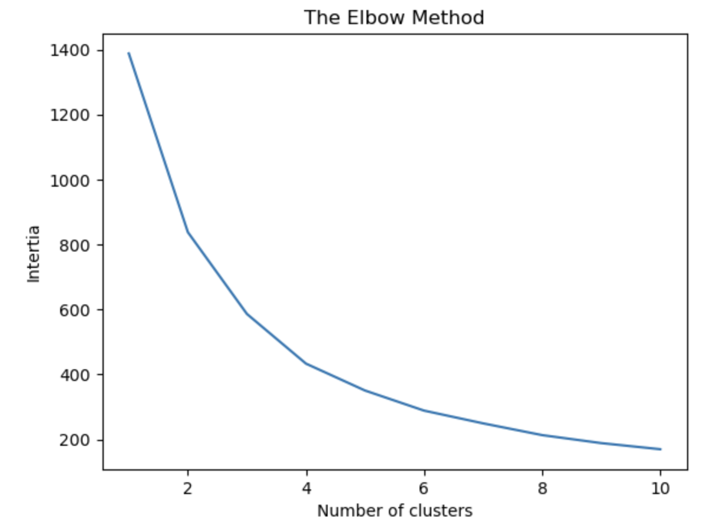
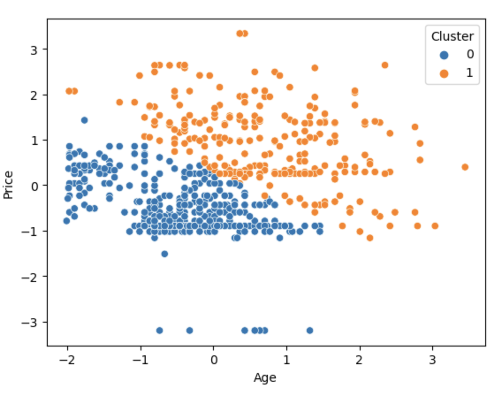
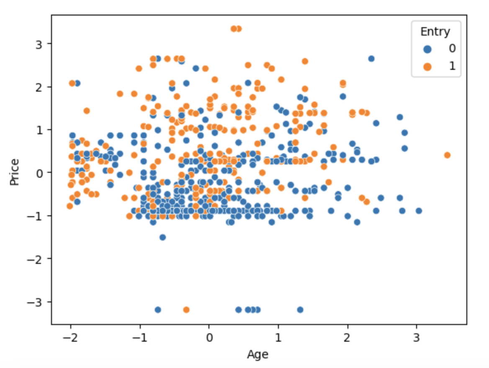

## Overview
This project explores the "Event_entry" dataset to understand and predict event entry grant (classification task) using PCA and KNN. The analyses include data exploration, visualization, principal component analysis (PCA), logistic regression models, and K-means clustering.

## Dataset Description
The "Event_entry" dataset consists of multiple features related to individuals attempting to gain entry to an event. Key features include demographic information, bank balance, ticket class, and price. The target variable indicates whether entry was granted (58%) or not (42%).

## Project Structure
The project is structured as follows:

- Data Exploration and Visualization:
  Examining distributions of various features through histograms, scatter plots, and box plots.

- PCA Analysis:
  PCA, or Principal Component Analysis, is a statistical technique used to simplify complex data sets. By identifying the most important features (or 'principal components'), PCA reduces the dimensionality of data while preserving as much variation as possible. This makes it easier to visualize and analyze large datasets by highlighting their most significant patterns and relationships, kind of like filtering out the noise to focus on the music. Here were using PCA to reduce dimensionality and developing logistic regression models with different numbers of dimensions to predict event entry.

- Decision Tree Analysis:
  Preparing data and training a decision tree classifier to predict event entry.

- K Means Clustering:
  K Means is a unsupervised ML algorithm which sorts data points into groups (clusters) based on their features, even though it doesn’t know anything about them beforehand. You tell it how many groups (k) to make, and it starts with random center points for each group, then shuffles data around, trying to keep similar items together while minimizing differences within each group. Here we are performing clustering based on Age and Price to analyze patterns within attendees.

## Main Highlights and Outcomes

- The dataset shows a comparable distribution among participants' bank balances and a similar gender ratio (~60-40) and a potential multicollinearity issue was identified between Price and Ticket Class.
- Logistic Regression model performance varies with the number of variables and PCA components:
Standard Logistic Regression with 6 variables achieved a 66% accuracy.
PCA-enhanced Logistic Regression showed varied accuracies (57% for 2 components, 61% for 4 and 6 components).

LASSO Logistic Regression outperformed other models with a 78% accuracy, indicating its effectiveness in identifying key variables.

- The optimal number of clusters for K-means, determined via the elbow method, was found to be 2, reflecting a significant change in inertia at this point.

 
  
 

 
  Knn clustering compared to the actual classes

## Conclusion
The analysis highlights the importance of selecting appropriate modeling techniques and the trade-offs between model complexity and performance. While PCA provides a lighter computational load, it may not always lead to better predictions, as evidenced by the varying accuracies. LASSO Logistic Regression proved to be more efficient for this particular dataset. Additionally, K-means clustering offered insightful unsupervised segmentation, though it clustered differently from the actual labels.
